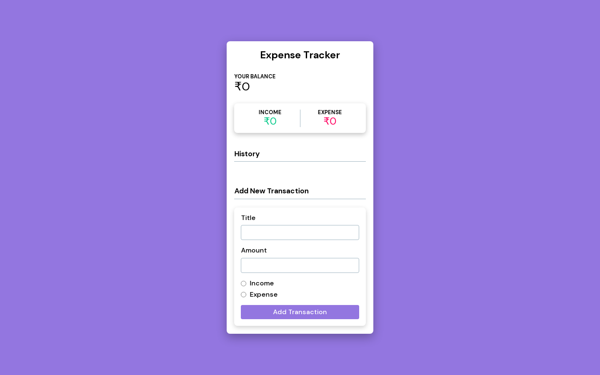

# EXPENSE TRACKER

## Welcome! 👋

This project is built using HTML, CSS and JS.
This project focuses on DOM manipulation by utilising CRUD operations to create transaction elements and update them dynamically on the ui. Delete a transaction and update a transaction.

## Tech Stack

**Client:** HTML, CSS, JS

## Deployment

Deploy this project on Github Pages / Vercel / Netlify.

**Live URL:** https://priyanshusharma0326.github.io/expense-tracker/
